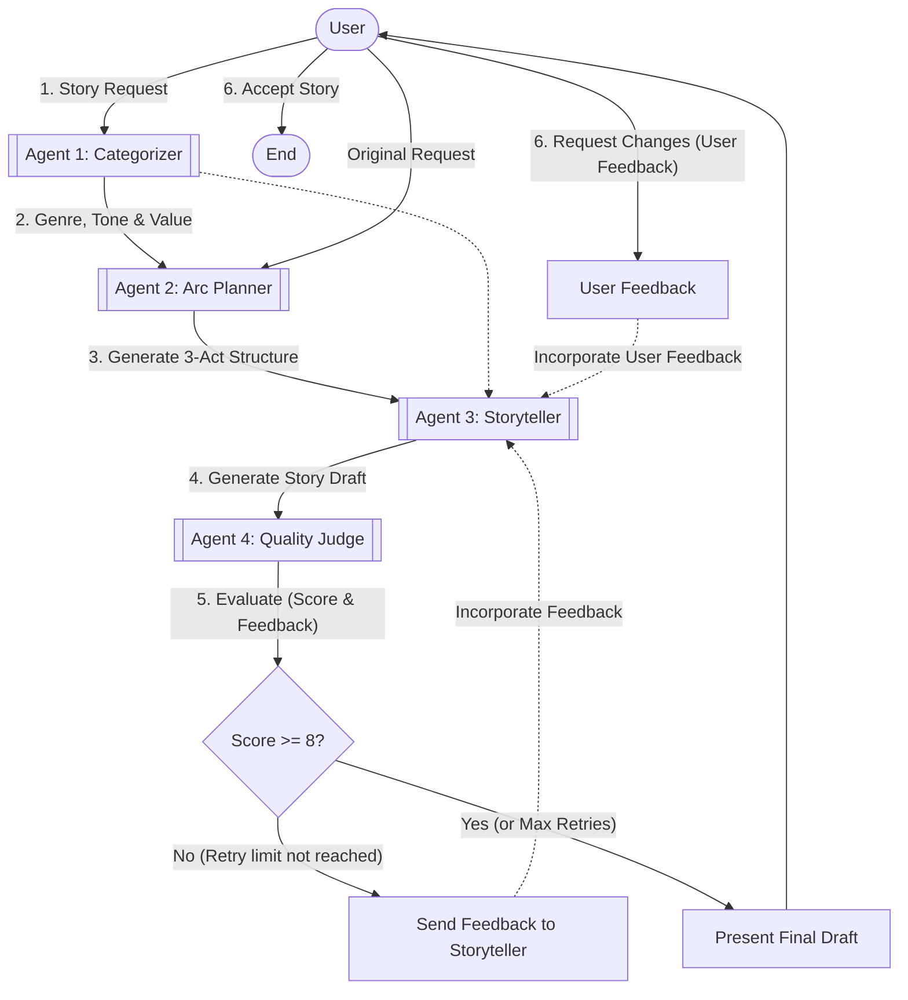

# TriageAI Bedtime Storyteller Architecture

This document illustrates the advanced multi-agent architecture of the AI Bedtime Storyteller system, showcasing the interactions between the User, Categorizer, Arc Planner, Storyteller, and Judge agents.

## Block Diagram

## Advanced Agent Design Strategy

To ensure this submission stands out, the system breaks the complex task of "writing a good story" into discrete, specialized agent roles. This prevents the LLM from becoming overwhelmed by a single mega-prompt and guarantees a high-quality, structured output.

1. **Agent 1: Categorizer**: Rather than just picking a genre, this agent actively assigns a *Tone* and a *Core Educational Value* (e.g., courage, sharing) to ensure the story has depth and age-appropriate messaging.
2. **Agent 2: Arc Planner**: Before a single word of the story is written, this agent structures a rigid 3-Act Outline (Introduction, Conflict, Resolution). This directly satisfies the requirement to *"Use story arcs to tell better stories"*.
3. **Agent 3: Storyteller**: The core creative agent. By following the strict guidelines provided by the Categorizer and Arc Planner, the Storyteller generates highly cohesive, well-paced narratives.
4. **Agent 4: Judge**: Acts as the strict editorial gatekeeper. It evaluates the draft against the original prompt and the planned arc, providing actionable feedback to the Storyteller if the quality score is below 8/10.

## Workflow Execution

1. **Initialization**: The user provides a raw prompt.
2. **Analysis & Planning**: The system categorizes the prompt and explicitly outlines a 3-act structure.
3. **Drafting**: The Storyteller writes the initial draft.
4. **Evaluation Loop**: The Judge reviews the draft. If it fails the threshold, the Storyteller revises it based on the Judge's specific critique. This can loop up to 2 times.
5. **Interactive Revisions**: The finalized story is presented to the user. The user can interactively request specific changes, triggering an immediate revision from the Storyteller.
